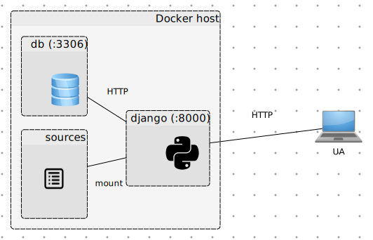

# jeuxngo-docker

[Dockerized](https://docker.com) [Django](https://www.djangoproject.com/) rewrite of [JEUX](https://github.com/marthjod/jeux) webapp

- Structure:

## Customize/prepare image resources

- Change `jeuxdb_user` password in _db/startup.sh_ and _data-volume/Dockerfile_

## Build images

- Data volume containing app's sources (cloned from [JEUX](https://github.com/marthjod/jeux)):
`docker build -t=jeuxngo/data-volume data-volume/`
- Database container (gets populated with [_jeuxdb.sql_](https://raw.githubusercontent.com/marthjod/jeux/master/jeuxdb-empty.sql) during build):
`docker build -t=jeuxngo/db db/`
- Django framework container:
`docker build -t=jeuxngo/django django/`

## Run containers

- `docker run -ti --name sources jeuxngo/data-volume`
- `docker run -d --name db jeuxngo/db`
- `docker run -d -p 8000:8000 --volumes-from sources --link db:db jeuxngo/django` (Optionally, replace first `8000` with a Docker host port where webapp should be accessible.)
- Check that web app is running at http://DOCKER_HOST:PORT/rankings/ (e.g., http://localhost:8000/rankings/)

